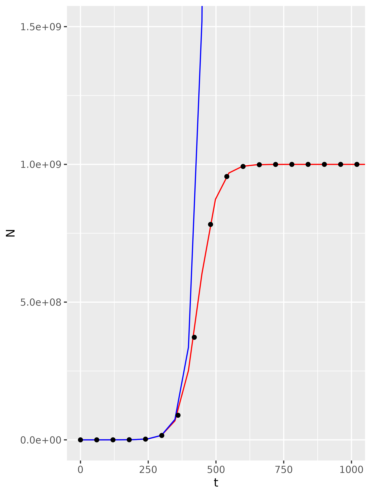

#Read Me file ; Answers to question 1, 2, and 3.

```{r}
install.packages("rmarkdown")
library(rmarkdown)
```


##Question 1

###Analysis Method:

The goal of the analysis is to take a single sample of an _Escherichia coli_ isolate growing in a growth media and estimate key growth parameters.  Namely, The starting population (No), the intrinsic growth rate (r) which is the exponential phase before density dependent limiting, and the carrying capacity (k). For reference,  I used experiment 2's csv data file (found in "data/experiment2.csv").

So,  we first Interrogated the data and plotted it ti see the sigmoidal curve, plotting the count "N" (y) against time (x). But this is hard to extract the useful parameters from. So, we can use log(N) as the response instead, this transformation allows us to more easily get the r value later. All of these initial plotting code can be found in "Analysis_Q123/plot_data.R".

From the transformed graph, we can use lm() to effective draw two straight lines that represent the growth phase and the stationary phase. The gradient of the growth phase is r, and the intercept is No. The gradient of the stationary phase should be ~0, and the intercept is K!

###Results:

Finding 'r': 
We can find r from this transformed graph by measuring the gradient when far from carrying capacity,  aka when 't' is low. For this, I chose t is less than 240 minutes to be safe -it seems to plateu at around 500.So, we subsetted the data to only <240, and analysed this with lm() as this is now effectively linear, the gradient (r) was *0.0303057*.

Finding 'No:
From the same linear model we can see that the starting pop is shown as the intercept. But remembering it is in ln(No), so No is e^7.5584677. Aka we estimate the starting pop (No) as *1917* cells. 

Finding 'K':
We can use the same method of fitting a linear model o a linear line extracted from the curve to find K by sub-setting the data to only include >1000 minutes (after carrying capacity is reached). Here K is the intercept, which we estimate at *1.000e+09 AKA 1,000,000,000 bacterial cells*.

All of the coding for this analysis is available in "fit_linear_model.R".

We can use these parameters to manually set out custom logistic model function and produce a model for the growth data. This code is shown in "Analysis_Q123/plot_data_and_model.R"

##Question 2

IF we assume the populaiton grows exponentially indefinitely, then we assume the r of 0.0303057 remians. 
So N = No * (exp(r*t)). 

For t=4980min we can plug in our known values to estimate N.

```{r}
N_at4980_expo <- 1916.91 * (exp(0.0303057*4980))
N_at4980_expo

#Or ? ln(N) = ln(No) + (r*t)

N_at4980_exp <- log10(1916.91) + (0.0303057*4980)
exp(N_at4980_exp)

```

We estimate that N at this time is 6.719874e+68.

This very large number is not realistic nor accurate because our bacteria did not grow exponentially like this. We can use the more accurate logistic growth model to estimate the time too. 

```{r}
N0 <-  1916.90598679 
r <- 0.0303057 
K <- 1.000e+09

N_at4980_logis <- (N0*K*exp(r*4980))/(K-N0+N0*exp(r*4980))
N_at4980_logis
```
Now we get 1e+09, which is carrying capacity. This makes biological sense looking at the initial plotted data as the culture seems to reach carrying capacity at ~1,000 min, so but this time they shouls be at stable carrying capacity!

##Question 3

The code for comparing the Two models (exponential and logistic) can be found in "Analysis_Q123/Comparing_Models.R".

#Attempt 1


#Attempt 2

<p align="center">

</p>

#Attempt 3


#Attempt 4

<p align="center">

</p>

#Attempt 5

<p align="center">
  
</p>

#Attempt 6

